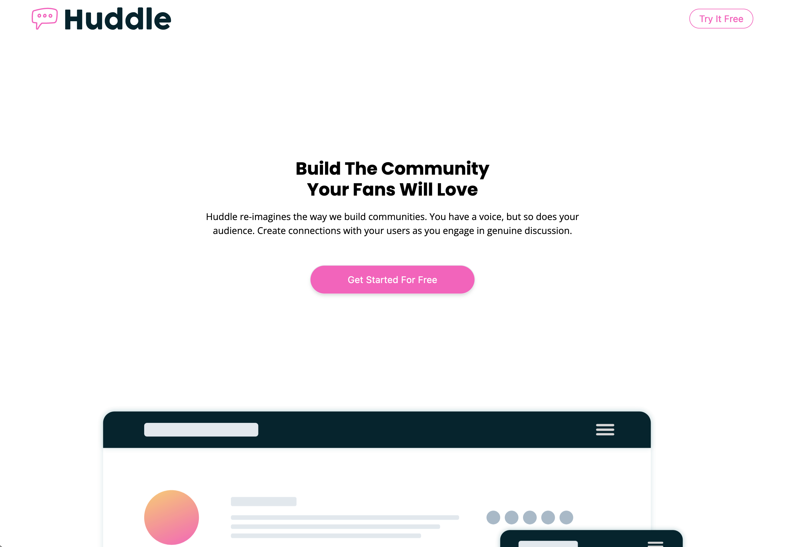
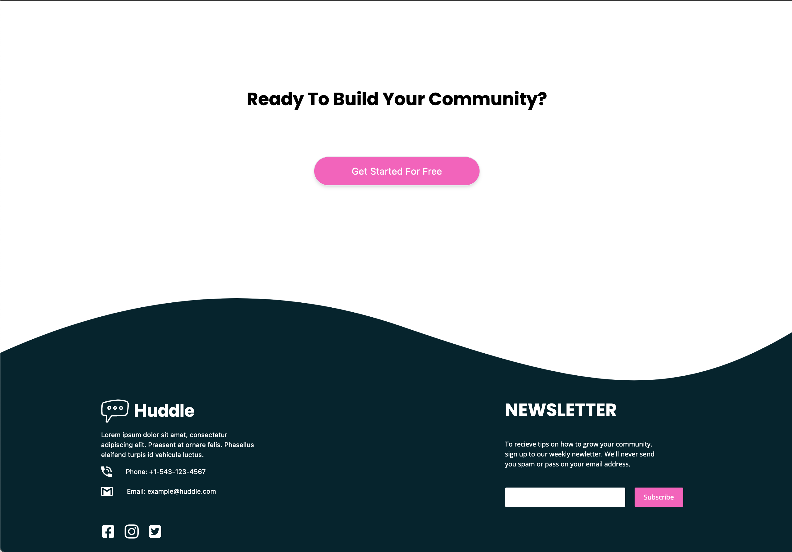

# Frontend Mentor - Huddle landing page with curved sections solution

This is a solution to the [Huddle landing page with curved sections challenge on Frontend Mentor](https://www.frontendmentor.io/challenges/huddle-landing-page-with-curved-sections-5ca5ecd01e82137ec91a50f2). Frontend Mentor challenges help you improve your coding skills by building realistic projects. 

## Table of contents

- [Overview](#overview)
  - [The challenge](#the-challenge)
  - [Screenshot](#screenshot)
  - [Links](#links)
- [My process](#my-process)
  - [Built with](#built-with)
  - [What I learned](#what-i-learned)
  - [Continued development](#continued-development)
  - [Useful resources](#useful-resources)
- [Author](#author)
- [Acknowledgments](#acknowledgments)

**Note: Delete this note and update the table of contents based on what sections you keep.**

## Overview

### The challenge

Users should be able to:

- View the optimal layout for the site depending on their device's screen size
- See hover states for all interactive elements on the page

### Screenshot

### Links

- Solution URL: [Add solution URL here](https://your-solution-url.com)
- Live Site URL: [https://fem-huddle-page-zeta.vercel.app/](https://fem-huddle-page-zeta.vercel.app/)

## My process

### Built with

- NextJS
- Tailwind CSS
- Mobile-first workflow
- [React](https://reactjs.org/) - JS library
- [Next.js](https://nextjs.org/) - React framework
- [Tailwind CSS](https://tailwindcss.com/) - For styles

### What I learned

My biggest takeaway from this project was component reuse. I was able to reuse the same component for the two different sections of the page. I also learned how to use quite a few new CSS properties that manipulate ordering and positioning of elements.

This project took a few hours to put together and with each project I'm getting faster at building out the pages. I'm also getting better at using Tailwind CSS and I'm starting to see the benefits of using it.

### Continued development

I'd like to continue using tailwind css for styling and also begin to use animations and transitions to make the pages more interactive. I'd also like to continue to use NextJS for building out the pages and hopefully become more familiar with the framework. I'm also going to start using the mobile first approach to building out the pages.

## Author

- Frontend Mentor - [@danmeldominique](https://www.frontendmentor.io/profile/danmeldominique)
- Github - [@danmeldominique](https://github.com/danmeldominique)